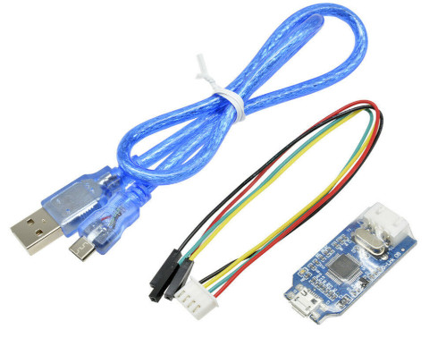
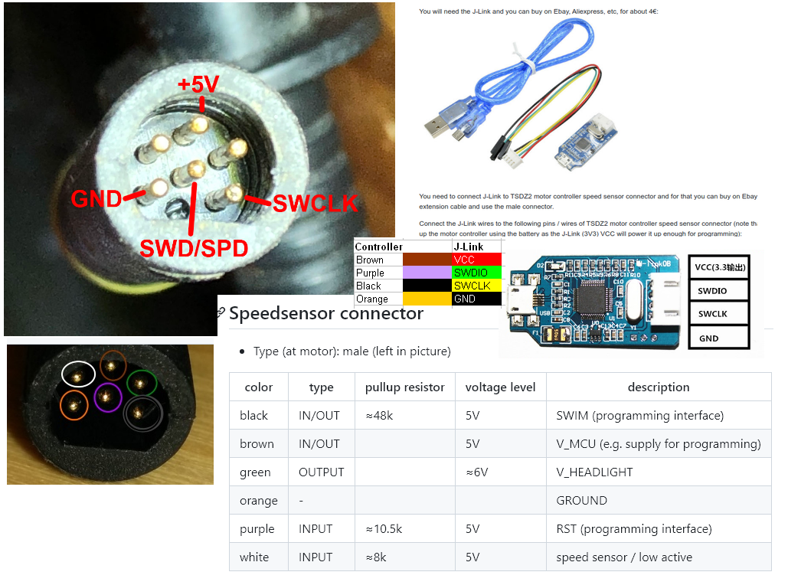
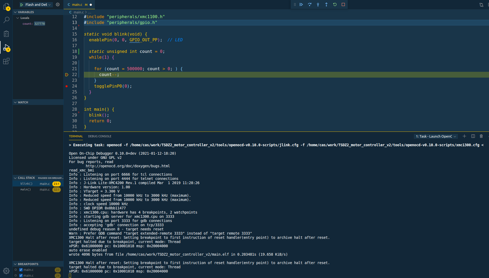

# Prepare and connect J-Link to the TSDZ2 motor controller V2

You will need the J-Link and you can buy on Ebay, Aliexpress, etc, for about 4€: 

You need to connect J-Link to TSDZ2 motor controller speed sensor connector and for that you can buy on Ebay, etc, a TSDZ2 speed sensor extension cable and use the male connector.

Connect the J-Link wires to the following pins / wires of TSDZ2 motor controller speed sensor connector (note that you will not need to power up the motor controller using the battery as the J-Link (3V3) VCC will power it up enough for programming):  
* Black --> GND
* Red --> (3V3) VCC
* Green --> SWCLK
* Blue --> SWDIO

# Configure Code Studio IDE for firmware development, flash and debug

Screenshot of a debug session of XMC1300 on Linux Ubuntu, using Visual Code Studio, OpenOCD and GDB:

 
 

For the firmware development, flash and debug, you can use the OpenSource and free IDE [Visual Studio Code](https://code.visualstudio.com/). For sure that others will work like the Eclipse.

This guide assumes you are using Linux Ubuntu (if you are on Windows or such, the install process should be similar).

## Software to install

- Add your user to the dialout group: __sudo usermod -a -G dialout USER_NAME__ and reboot
- install [Visual Studio Code](https://code.visualstudio.com/)
  - install C/C++ extension (to edit C/C++ source files)
  - install Cortex-Debug extension (to be able to debug ARM microcontroller)
  - install Task Manager extension (to call makefile and other commands)
- install OpenOCD (to connect to STLinkV2): __sudo apt-get install openocd__
- install GDB GNU debugger (for debug and connect to OpenOCD): __sudo apt-get install gdb-multiarch__
- install ARM C/C++ GCC compiler: __sudo apt-get install gcc-arm-none-eabi__
- install ARM binutils: __sudo apt-get install binutils-arm-none-eabi__
- install ARM newlib: __sudo apt-get install libnewlib-arm-none-eabi__

## Open project folder with Visual Studio Code

Click on menu File -> Open folder... and select the firmware directory.

## Build the code

Because you installed the Task Manager extension, you should see Task manager icon on the left bar - click on it. The build, clean and Launch OpenOCD tasks should be available.

Start by clicking on the clean to clean the code and then click on the build to build the code.

The clean and build tasks call the __make clean__ and __make__ on the terminal. The tasks configurations are on the file .vscode/tasks.json.

## Flash the firmware and debug

1. Connect the J-Link to the motor controller

2. Click on the task Launch OpenOCD

You will need to click only once. The OpenOCD should connect to the microcontroller and keep active.

The task Launch OpenOCD configuration is on the file .vscode/tasks.json.

3. Click Flash and Debug

Click on the debug icon on the left panel and then click on the small green arrow for the Flash and Debug - will flash the firmware on the microcontroller and then start the debug of the firmware.

The Flash and Debug configuration is on the file .vscode/launch.json.
