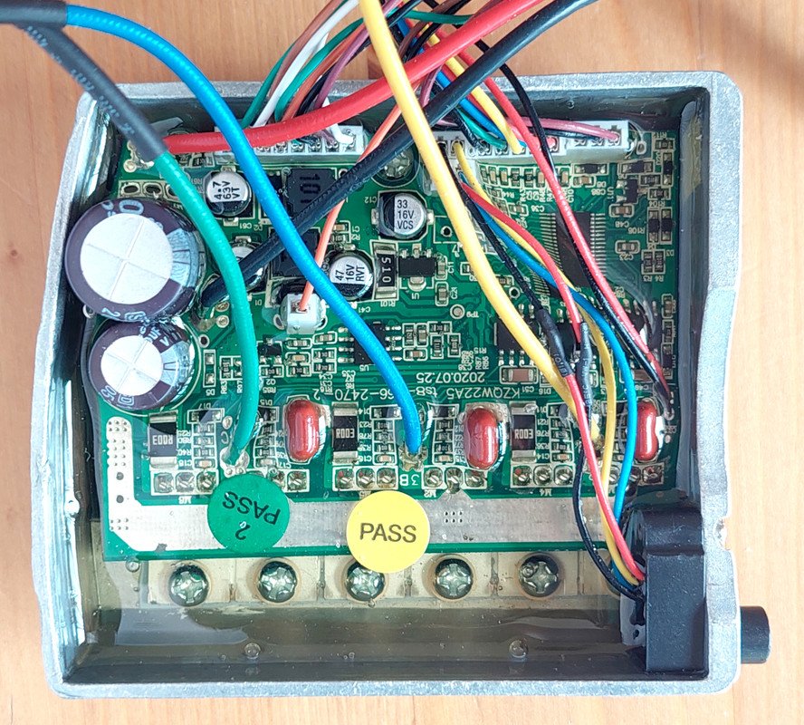
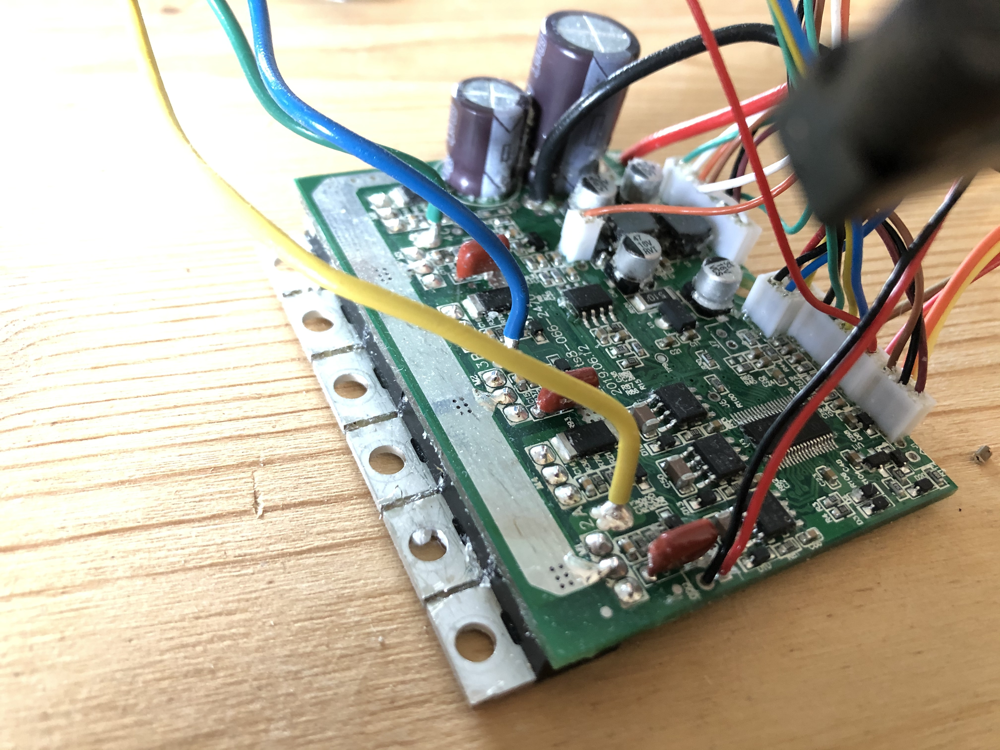
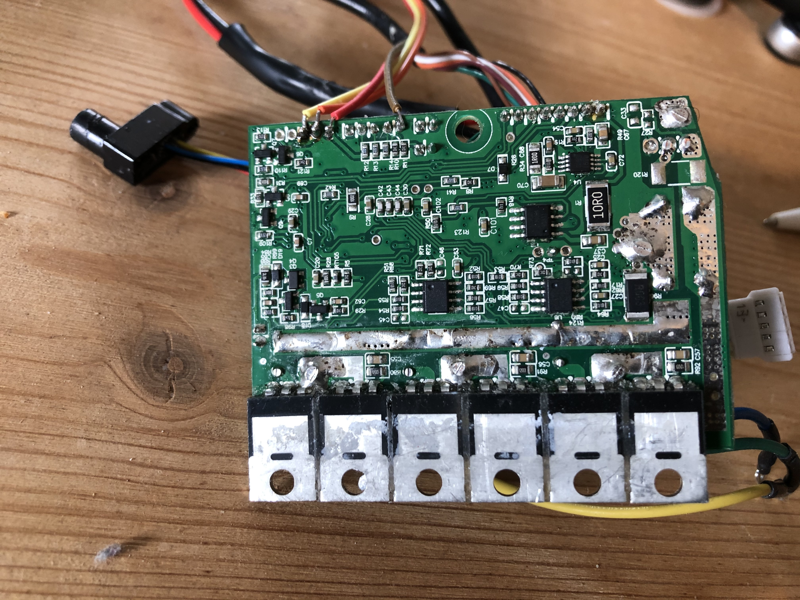
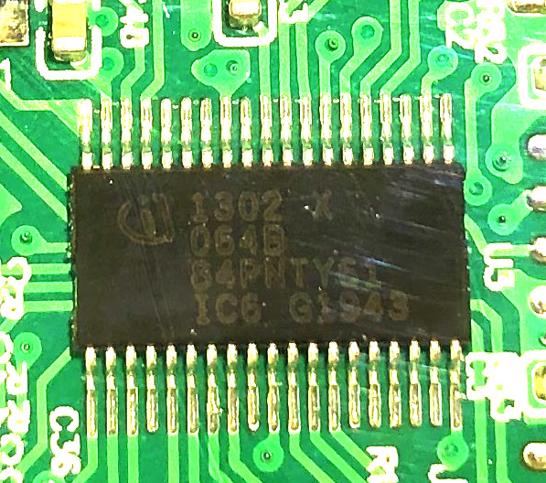

* XMC1302: the microcontroller is the XMC1302-T038X0064 of 38 pins.
  * [XMC1300 datasheet](Documentation/XMC1300_datasheet.pdf)
  * [XMC1300 reference manual](Documentation/XMC1300_reference_manual.pdf)
  * [XMC1300 math coprocessor](Documentation/Infineon-IP_MATH_XMC1000-TR-v01_02-EN.pdf)
* [XL7005A](XL7005A.pdf): there is one XL7005A dc-dc, at back side.
* [IRS2005](IRS2005.pdf): there are three of these power mosfet drivers, on front side. These are for driving the 6 power mosfets.
* [LM258](LM258.pdf): there is one LM258, dual opamp, at back side.
* [MCP6021](MCP6021.pdf): there is one MCP6021 opamp, at back side.
* there is one big resistor of R003 (0.003 ohms) at back side to measure the battery current
* there are three big resistors of R003 (0.003 ohms) at front side to measure each motor phase current

 

  
